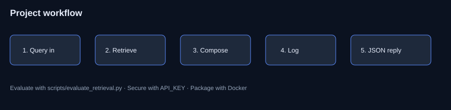

<div align="center">

# AI-Driven Chatbot for Smart Tourism

### B.Tech Major Project · Applied AI · NLP · FastAPI Demo

[](https://www.python.org/)
[](https://fastapi.tiangolo.com/)
[](Dockerfile)
[](.github/workflows/ci.yml)
[](LICENSE)

**Amaragani Nikhil Sai** · B.Tech CSE · SIIET (JNTUH) · Major project prototype  
Runnable offline demo with optional API-key auth. Honest scope: local retrieval demo, not commercial traffic.

[Problem](#problem) · [Solution](#solution) · [Architecture](#architecture) · [Installation](#installation) · [Usage](#usage)

</div>

---

## Problem

Travel support is information-heavy. Simple keyword bots miss paraphrases; answers are often ungrounded. This major project studies a modular chatbot framework for smart tourism and ships a **runnable prototype** with retrieval, intent routing, logging, and an API surface.

---

## Solution

A modular Applied AI tourism assistant with:

- RAG-style retrieval over a curated tourism knowledge base  
- Intent routing fallback  
- FastAPI REST API + CLI  
- Optional API-key authentication  
- SQLite conversation logging  
- Offline evaluation harness  
- Docker packaging + CI tests  
- Documented upgrade path (vector DB / LLM)  

---

## Features

| Feature | Status |
|---------|--------|
| TF-IDF / hashing vector retrieval | Implemented |
| Intent + template fallback | Implemented |
| REST: health, chat, history | Implemented |
| Optional `X-API-Key` auth | Implemented |
| Evaluation script (hit-rate) | Implemented |
| Docker + GitHub Actions | Implemented |
| Full LangChain / paid LLM backend | Roadmap (not claimed live) |

---

## Architecture




```text
Client → FastAPI (+ optional API key)
            ├─ Retriever (RAG-style)
            ├─ Intent router
            └─ Composer / optional LLM
                    ↓
            SQLite conversation log
```

---

## Tech stack

Python · FastAPI · Pydantic · scikit-learn · NumPy · SQLite · Docker · pytest · GitHub Actions

---

## Folder structure

```text
config/  src/api/  src/chatbot/  tests/  docs/  scripts/  images/  data/
Dockerfile  docker-compose.yml  requirements.txt  .github/workflows/ci.yml
```

---

## Installation

```bash
git clone https://github.com/nikhilamaragani-jpg/ai-driven-chatbot-smart-tourism.git
cd ai-driven-chatbot-smart-tourism
python -m venv .venv && source .venv/bin/activate  # Windows: .venv\Scripts\activate
pip install -r requirements.txt
cp .env.example .env
```

---

## Usage

```bash
# CLI
python src/main.py

# API
uvicorn src.api.app:app --reload --port 8000

# Evaluate retrieval
python scripts/evaluate_retrieval.py

# Tests
pytest -q

# Docker
docker compose up --build
```

```bash
curl -s http://127.0.0.1:8000/health
curl -s -X POST http://127.0.0.1:8000/chat \
  -H "Content-Type: application/json" \
  -d '{"message":"budget planning tips"}'
```

With auth: set `API_KEY` and pass header `X-API-Key`.

---

## Project workflow

1. Curate tourism FAQ knowledge  
2. Index for retrieval  
3. Accept query via CLI/API  
4. Retrieve → compose (or intent template)  
5. Log turn → return structured JSON  
6. Evaluate hit-rate offline  

---

## Screenshots

| Asset | Path |
|-------|------|
| Architecture | [images/architecture.svg](images/architecture.svg) |
| Workflow | [images/workflow.svg](images/workflow.svg) |
| API docs | Run server → `/docs` |
| Eval sample | [data/outputs/retrieval_eval.sample.json](data/outputs/retrieval_eval.sample.json) |

---

## Results

- Offline retrieval eval sample on labeled queries (re-run script for live numbers)  
- API returns `intent`, `source`, `retrieval_scores` for review and demos  

**Prototype vs full report:** this repo is the runnable core; broader UML/web/LLM vision stays in report/roadmap.

---

## Future improvements

- [ ] Optional LLM generation when a key is available  
- [ ] Chroma/FAISS embeddings backend  
- [ ] PostgreSQL multi-user history  
- [ ] Stronger evaluation suite  

---

## Skills demonstrated

Applied AI · NLP · RAG-style design · REST APIs · evaluation · Docker · CI · modular Python · technical documentation

---

## Documentation

[PROJECT_BRIEF](docs/PROJECT_BRIEF.md) · [DEMO](docs/DEMO.md) · [INTERVIEW](docs/INTERVIEW.md) · [RESUME_BULLETS](docs/RESUME_BULLETS.md) · [API](docs/API.md) · [ARCHITECTURE](docs/ARCHITECTURE.md) · [EVALUATION](docs/EVALUATION.md)

---

## License

MIT — see [LICENSE](LICENSE).

**Author:** Amaragani Nikhil Sai · B.Tech CSE · https://nikhilamaragani-jpg.github.io/ · nikhilamaragani@gmail.com
