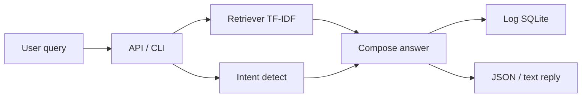

<div align="center">

# Smart Tourism Chatbot

### Applied AI · NLP · RAG-style Retrieval · FastAPI

[](https://www.python.org/)
[](https://fastapi.tiangolo.com/)
[](Dockerfile)
[](LICENSE)
[](.github/workflows/ci.yml)

**Portfolio project** by [Amaragani Nikhil Sai](https://github.com/nikhilamaragani-jpg)  
Runnable demo + REST API. Not claimed as a commercial production deployment.

[Problem](#problem) · [Solution](#solution) · [Architecture](#architecture) · [Install](#installation) · [Usage](#usage) · [Docs](#documentation)

</div>

---

## Problem

Travelers need fast, structured answers on attractions, transport, hotels, and budgets. Hard-coded scripts break when phrasing changes, lack retrieval over a knowledge base, and rarely expose a clean API for integration.

| Pain point | Impact |
|------------|--------|
| Keyword-only bots | Miss paraphrases and multi-intent queries |
| No retrieval layer | Answers not grounded in a curated FAQ corpus |
| CLI-only demos | Hard for teams to integrate or evaluate |
| No observability | Cannot review conversation quality |

---

## Solution

A **modular Applied AI tourism assistant** with:

1. **Knowledge retrieval** (TF-IDF RAG-style over a curated tourism FAQ corpus)  
2. **Intent routing** for structured categories (hotel, transport, budget, …)  
3. **Response generation** grounded in retrieved snippets or intent templates  
4. **SQLite conversation logging** for audit / evaluation  
5. **FastAPI REST API** + CLI for demos  
6. **Docker packaging** and CI tests  

Honest scope: this is a **portfolio-grade production-style system**. LLM/vector DB backends and auth are designed as extensions (see roadmap).

---

## Features

- RAG-style retrieval over tourism knowledge (no paid API key required for local demo)  
- Intent classification via keyword rules (replaceable NLP module)  
- REST endpoints: health, chat, history  
- CLI interactive mode  
- Conversation persistence (SQLite)  
- Structured logging  
- Docker + docker-compose  
- Unit tests + GitHub Actions CI  
- Environment-based configuration  

---

## Architecture

```text
Client (CLI / HTTP)
        |
        v
+-------------------+     +----------------------+
| FastAPI / CLI     | --> | Config (.env)        |
+-------------------+     +----------------------+
        |
        v
+-------------------+     +----------------------+
| Intent Router     |     | TF-IDF Retriever     |
| (rules / NLP)     |     | (RAG-style KB)       |
+-------------------+     +----------------------+
        |                          |
        +------------+-------------+
                     v
            Response Composer
                     |
                     v
            SQLite Conversation Store
```



---

## Tech stack

| Layer | Technology |
|-------|------------|
| Language | Python 3.10+ |
| API | FastAPI, Uvicorn, Pydantic |
| Retrieval | scikit-learn TF-IDF (local RAG-style) |
| Storage | SQLite |
| Config | python-dotenv |
| Packaging | Docker, docker-compose |
| Quality | pytest, GitHub Actions |
| Roadmap | LangChain adapters, vector DB, LLM APIs, auth |

---

## Folder structure

```text
.
├── README.md
├── LICENSE
├── .gitignore
├── requirements.txt
├── Dockerfile
├── docker-compose.yml
├── .env.example
├── pyproject.toml
├── .github/workflows/ci.yml
├── config/settings.py
├── src/
│   ├── main.py                 # CLI entry
│   ├── api/app.py              # FastAPI app
│   └── chatbot/
│       ├── intent.py
│       ├── knowledge.py
│       ├── retriever.py        # RAG-style retrieval
│       ├── response.py
│       ├── service.py          # orchestration
│       └── database.py
├── tests/
├── docs/
├── data/                       # SQLite runtime (gitignored content)
├── scripts/
└── images/                     # screenshots / diagrams placeholders
```

---

## Installation

```bash
git clone https://github.com/nikhilamaragani-jpg/ai-driven-chatbot-smart-tourism.git
cd ai-driven-chatbot-smart-tourism
python -m venv .venv
# Windows: .venv\Scripts\activate
source .venv/bin/activate
pip install -r requirements.txt
cp .env.example .env
```

---

## Usage

### CLI demo

```bash
python src/main.py
```

Try: `places to visit` · `visa requirements` · `budget planning` · `history` · `exit`

### REST API

```bash
uvicorn src.api.app:app --reload --port 8000
```

```bash
curl -s http://127.0.0.1:8000/health
curl -s -X POST http://127.0.0.1:8000/chat \
  -H "Content-Type: application/json" \
  -d '{"message": "best hotels and metro tips"}'
```

Interactive docs: http://127.0.0.1:8000/docs

### Docker

```bash
docker compose up --build
```

API on `http://localhost:8000`

### Tests

```bash
pytest -q
```

---

## Project workflow

1. Ingest / curate tourism FAQ knowledge  
2. Build TF-IDF index (on startup)  
3. Accept user query via CLI or API  
4. Retrieve top-k knowledge snippets  
5. Detect intent as fallback / metadata  
6. Compose answer + log turn  
7. Return structured response for evaluation  

---

## Screenshots

| Asset | Path |
|-------|------|
| Architecture diagram | See mermaid above · export to `images/architecture.png` (optional) |
| API docs | Run server → `/docs` · capture to `images/api_docs.png` |
| CLI session | Capture to `images/cli_demo.png` |

Placeholder notes live in [`images/README.md`](images/README.md).

---

## Results

| Capability | Status |
|------------|--------|
| Local RAG-style retrieval | Implemented (TF-IDF) |
| Intent + template replies | Implemented |
| REST chat + history | Implemented |
| Conversation logging | Implemented (SQLite) |
| Docker + CI | Implemented |
| Production LLM / vector DB | Roadmap (not claimed live) |
| Auth / multi-tenant | Roadmap |

---

## Future improvements

- [ ] LangChain orchestration adapter  
- [ ] Vector database (Chroma / FAISS / pgvector)  
- [ ] Optional OpenAI / local LLM generation  
- [ ] API key / JWT authentication  
- [ ] Evaluation harness (precision@k, groundedness checklist)  
- [ ] PostgreSQL for multi-user history  
- [ ] Cloud deploy (Azure / AWS free tier)  

---

## Skills demonstrated

| Skill | Evidence |
|-------|----------|
| Applied AI / NLP | Intent + retrieval + response pipeline |
| RAG design | Local TF-IDF retriever over knowledge corpus |
| Backend / REST | FastAPI endpoints, Pydantic models |
| Data engineering basics | Structured logs, SQLite persistence |
| Software engineering | Packages, config, tests, Docker, CI |
| Documentation | Problem → architecture → runbook |

---

## Documentation

| Doc | Purpose |
|-----|---------|
| [docs/PROJECT_BRIEF.md](docs/PROJECT_BRIEF.md) | Product / technical brief |
| [docs/DEMO.md](docs/DEMO.md) | 5-minute demo script |
| [docs/INTERVIEW.md](docs/INTERVIEW.md) | Hiring walkthrough |
| [docs/RESUME_BULLETS.md](docs/RESUME_BULLETS.md) | Resume lines |
| [docs/ARCHITECTURE.md](docs/ARCHITECTURE.md) | Deeper design |
| [docs/API.md](docs/API.md) | Endpoint reference |
| [docs/ABOUT_TOPICS.md](docs/ABOUT_TOPICS.md) | GitHub About / topics |

---

## Author

**Amaragani Nikhil Sai** · B.Tech CSE · Junior Data / ML / Applied AI  
Portfolio: https://nikhilamaragani-jpg.github.io/  
Email: nikhilamaragani@gmail.com  
LinkedIn: https://www.linkedin.com/in/nikhil-sai-amaragani-219115382

## License

MIT — see [LICENSE](LICENSE).
