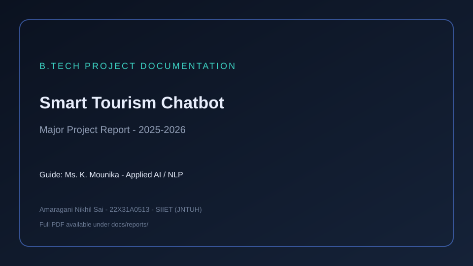
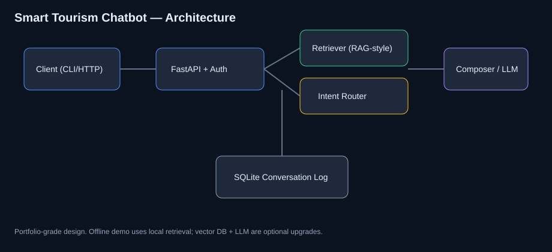

<div align="center">

# AI-Driven Chatbot Framework for Smart Tourism

### B.Tech Major Project (2025–2026) · Applied AI · NLP · FastAPI Demo

[](https://www.python.org/)
[](https://fastapi.tiangolo.com/)
[](Dockerfile)
[](LICENSE)

**Amaragani Nikhil Sai** · Roll **22X31A0513** · SIIET (JNTUH)  
**Guide:** Ms. K. Mounika · Full report title: *AI-Driven Chatbot Framework for Smart Tourism: A System Architecture and Systematic Review*

Runnable offline prototype. Academic report includes wider research, UML, and web UI vision — see [docs/REPORT_SUMMARY.md](docs/REPORT_SUMMARY.md).

[Problem](#problem) · [Solution](#solution) · [Architecture](#architecture) · [Installation](#installation) · [Docs](#documentation)

</div>

---




## Problem

Tourism is information-intensive. Travelers need help with destinations, stays, transport, and planning. Many bots are **rule-based**, lose multi-turn context, give generic answers, and do not integrate with real tourism services. The major project studies this gap and proposes a smarter framework aligned with the tourism **6A** model (Attractions, Accessibility, Amenities, Activities, Available Packages, Ancillary Services).

---

## Solution

**Academic report:** system architecture, literature/tool survey, UML, functional requirements, and sample web-oriented implementation concepts (including multilingual and booking integration vision).

**This repository:** a modular **runnable prototype** you can clone today:

- RAG-style retrieval over a curated tourism knowledge base  
- Intent routing fallback  
- CLI + FastAPI REST API  
- Optional API-key auth  
- SQLite conversation logging  
- Evaluation harness, Docker, CI  

---

## Features

| Feature | Status |
|---------|--------|
| Local RAG-style retrieval | Implemented (this repo) |
| Intent + template fallback | Implemented |
| REST chat / history / health | Implemented |
| Conversation logging | Implemented |
| Docker + tests | Implemented |
| Full web login/dashboard UI from report screens | Report scope / roadmap |
| Live booking / airline APIs | Report scope / roadmap |
| Full multilingual production stack | Report objective / partial samples |

---

## Architecture



**Report layers:** User interface → Chatbot processing (NLP) → AI/ML → Database → Integration → Response generation.  
**Repo implementation:** Client (CLI/HTTP) → FastAPI → Retriever + Intent → Composer → SQLite log.

---

## Tech stack

| | Report vision | This repo |
|--|---------------|-----------|
| Language | Python (+ web stack) | Python 3.10+ |
| API / UI | Web app screens | FastAPI + CLI |
| NLP / AI | ML / DL / NLP / optional LLM | scikit-learn retrieval + rules |
| Storage | DBMS (e.g. MySQL models in samples) | SQLite chat history |
| Packaging | — | Docker, GitHub Actions |

---

## Installation

```bash
git clone https://github.com/nikhilamaragani-jpg/ai-driven-chatbot-smart-tourism.git
cd ai-driven-chatbot-smart-tourism
pip install -r requirements.txt
cp .env.example .env
python src/main.py
```

API: `uvicorn src.api.app:app --reload` → http://127.0.0.1:8000/docs

---

## Usage

**CLI:** `places to visit` · `budget planning` · `history` · `exit`  
**API:** `POST /chat` with `{"message":"..."}`  
**Eval:** `python scripts/evaluate_retrieval.py`

---

## Project workflow

1. Knowledge base (tourism FAQs / 6A-aligned themes)  
2. Retrieve top snippets  
3. Compose answer or intent template  
4. Log turn  
5. Return structured result for review  

---

## Documentation

| Doc | Purpose |
|-----|---------|
| [REPORT_SUMMARY.md](docs/REPORT_SUMMARY.md) | **Report facts** from major project PDF |
| [PROJECT_BRIEF.md](docs/PROJECT_BRIEF.md) | Short technical brief |
| [DEMO.md](docs/DEMO.md) | 5-minute demo |
| [INTERVIEW.md](docs/INTERVIEW.md) | Pitch + Q&A |
| [RESUME_BULLETS.md](docs/RESUME_BULLETS.md) | Resume lines |
| [API.md](docs/API.md) · [ARCHITECTURE.md](docs/ARCHITECTURE.md) · [EVALUATION.md](docs/EVALUATION.md) | Engineering notes |

---

## Skills demonstrated

Problem framing · conversational AI · RAG-style design · REST APIs · modular Python · evaluation · documentation · honest academic vs prototype scoping

---

## License

MIT · **Author:** Amaragani Nikhil Sai · https://nikhilamaragani-jpg.github.io/

### Academic report PDF

- **Major project PDF:** [docs/reports/Major_Project_Smart_Tourism_Chatbot_Report.pdf](docs/reports/Major_Project_Smart_Tourism_Chatbot_Report.pdf)

