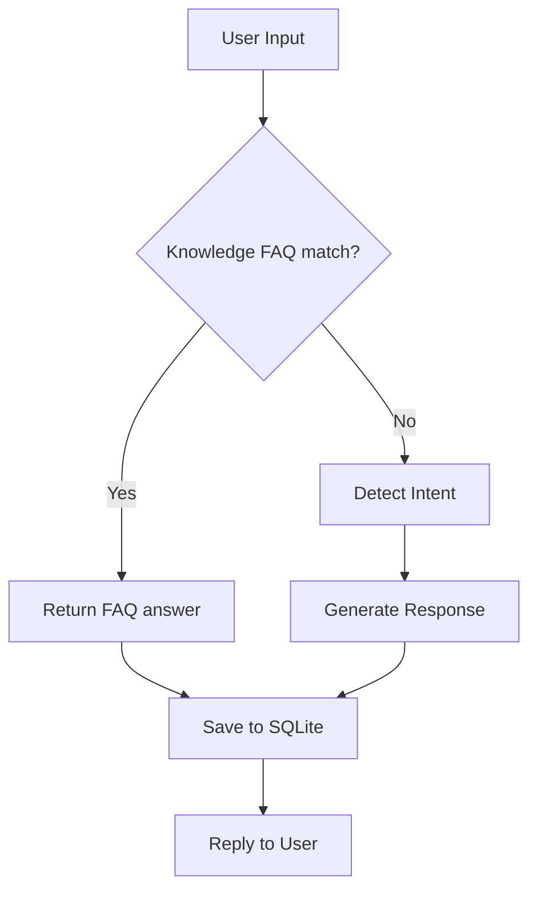

# Demo Walkthrough — Smart Tourism Chatbot

## Expected terminal session

```text
============================================================
  Smart Tourism Chatbot  |  B.Tech Major Project Prototype
  Intent detection · Knowledge base · Conversation logging
  Commands: history | help | exit
============================================================

You: hello
Bot (greeting): Hello! I am your Smart Tourism assistant...

You: places to visit
Bot (knowledge_faq): Tell me the city or region you plan to visit...

You: visa requirements
Bot (knowledge_faq): Visa requirements depend on your nationality...

You: plan a 3 day itinerary
Bot (itinerary_query): I can help you plan an itinerary...

You: history
--- Recent Conversations ---
[timestamp] Intent: ...

You: exit
Bot: Thank you! Have a great trip.
```

## What to point out in interviews

1. **Two-path reasoning:** knowledge match vs intent routing
2. **Persistence:** history survives across turns in SQLite
3. **Modularity:** each concern is a separate module
4. **Extensibility:** swap intent.py for an NLP/LLM backend later

## Architecture diagram


