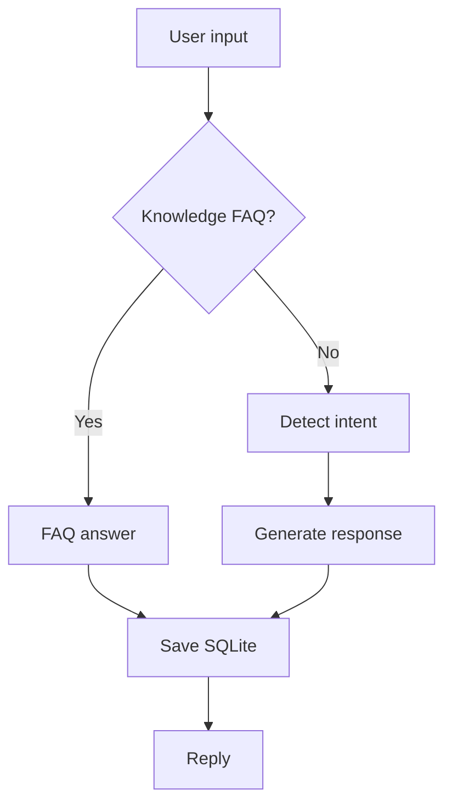

# Demo walkthrough

```bash
pip install -r requirements.txt
python src/main.py
```

Expected flow:

```text
============================================================
  Smart Tourism Chatbot  |  B.Tech Major Project Prototype
============================================================
You: hello
Bot (greeting): ...
You: places to visit
Bot (knowledge_faq / intent): ...
You: history
--- Recent Conversations ---
You: exit
```


