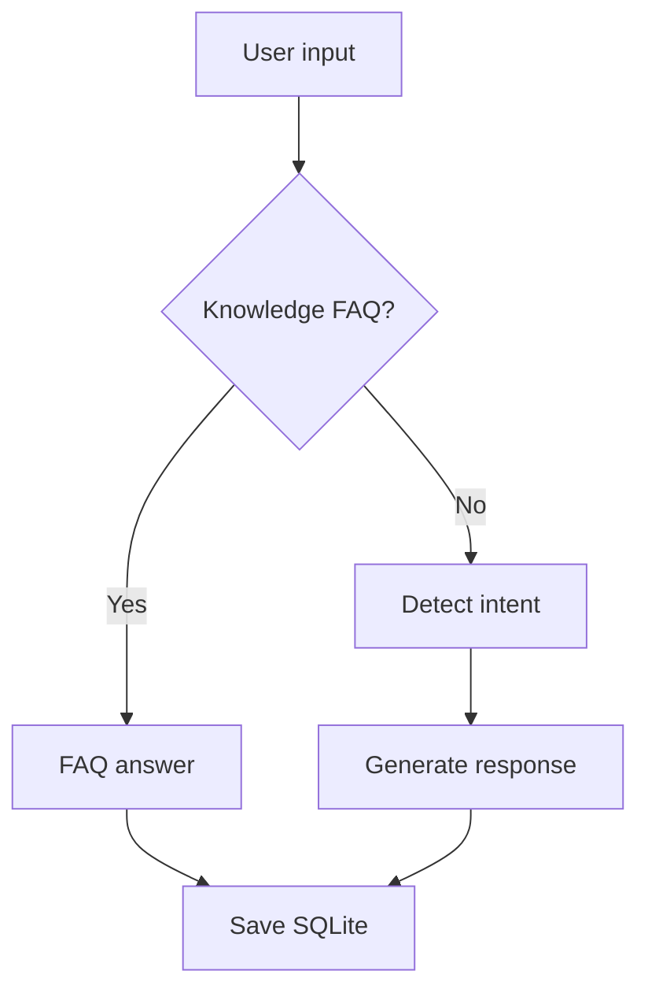

# Demo walkthrough

```bash
pip install -r requirements.txt
python src/main.py
```

```text
Smart Tourism Chatbot  |  B.Tech Major Project Prototype
You: hello
Bot: ...
You: places to visit
Bot: ...
You: history
You: exit
```


